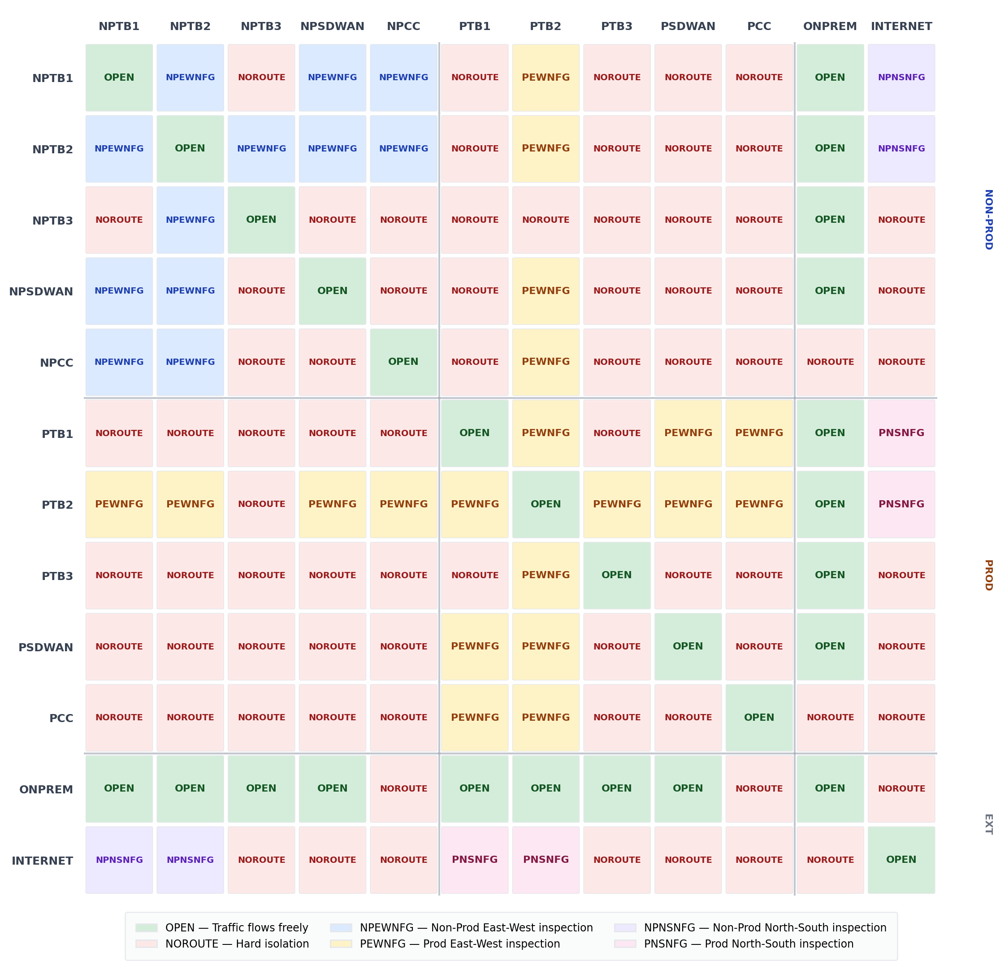

# Best Buy Cloud WAN Segment Matrix — Core Network Policy

> Companion repository to the AWS Networking & Content Delivery Blog post  
> **[Beyond the Gateway: How Best Buy's Cloud WAN Segment Matrix Turns Network Routing into a Security Superpower](https://aws.amazon.com/blogs/networking-and-content-delivery/)**

*Co-authored by Jason Schamp (AWS), Mandar Sawant (AWS), and Moulee Natarajan (Best Buy)*

---

## Overview

This repository contains the reference AWS Cloud WAN core network policy (`cwan-sample-segmentmatrix.json`) described in the blog post above.

The policy implements:

- **11 segments** covering workload trust boundaries (TB1/TB2/TB3), SD-WAN entry points, cross-cloud connectivity, and on-premises Direct Connect — for both Production and Non-Production environments
- **4 Network Function Groups (NFGs)** providing east-west and north-south inspection via AWS Network Firewall, scoped by environment
- **Tag-based attachment policies** that automatically assign new VPC attachments to the correct segment using resource tags — no route-table work, no change windows
- **Advanced attachment routing policies** carrying BGP community tags to SD-WAN appliances for tag-based (not IP/subnet-based) traffic decisions
- **Policy schema version 2025.11** — required for advanced routing policy support (the default schema is 2021.12)

---

## The Segment Matrix

Instead of designing segments around network topology or org structure, Best Buy mapped segments to trust boundaries — the same categories security and PCI assessors already use. Every segment pair gets one of three answers:

| Answer | Meaning |
|---|---|
| **NOROUTE** | Default — the path doesn't exist. Can't be misconfigured. |
| **NFG** | Inspected path — traffic traverses exactly one Network Function Group. |
| **OPEN** | Flat routing within the same trust boundary or sanctioned path (e.g., ONPREM). |



*Figure: Every segment pair is explicitly NOROUTE, inspected via an NFG, or OPEN. The TB3/CDE rows and columns are almost entirely NOROUTE — this is intentional. See the [CDE isolation note](#-cde--tb3-segments-intentionally-isolated) below before adapting this design.*

### Segments

| Segment | Description |
|---|---|
| `NPTB1` / `PTB1` | Non-Prod / Prod — Non-Trusted Workload |
| `NPTB2` / `PTB2` | Non-Prod / Prod — Shared Services |
| `NPTB3` / `PTB3` | Non-Prod / Prod — **Cardholder Data (PCI-DSS) — intentionally isolated. See note below.** |
| `NPSDWAN` / `PSDWAN` | Non-Prod / Prod — SD-WAN tunnel-less Connect attachments |
| `NPCC` / `PCC` | Non-Prod / Prod — Cross-cloud connectivity |
| `ONPREM` | Direct Connect Gateway from data centers |

### Network Function Groups

| NFG | Scope |
|---|---|
| `NPEWNFG` | Non-Prod east-west inspection |
| `PEWNFG` | Prod east-west inspection (also owns the sanctioned NP→Prod shared services path) |
| `NPNSNFG` | Non-Prod north-south (internet egress) inspection |
| `PNSNFG` | Prod north-south (internet egress) inspection |

---

## ⚠️ CDE / TB3 Segments: Intentionally Isolated

**`NPTB3` and `PTB3` (Cardholder Data Environments) have no lateral egress by design.** In the segment matrix, their outbound rows are almost entirely NOROUTE — this is the primary PCI-DSS segmentation control in this architecture, enforced at the routing layer, not only at the firewall.

The only defined paths for these segments are:

- **Inbound from NPTB2 → NPTB3** via `NPEWNFG` (inspected) — for sanctioned non-prod shared services access
- **Inbound from PTB2 → PTB3** via `PEWNFG` (inspected) — for sanctioned prod shared services access
- **ONPREM ↔ NPTB3 / PTB3** — OPEN, because on-premises inspection is owned by the edge firewall at the datacenter

> **If you are adapting this policy:** Do not add `send-via`, `send-to`, or `share` rules for `NPTB3` or `PTB3` without a compliance review. Adding a routing path here removes a PCI-DSS segmentation control at the network layer — a firewall rule alone is not a substitute for a non-existent route.

---

## ⚠️ ONPREM Trust and SD-WAN Tag-Based Control

Two aspects of this design are correct by intent but require explicit acknowledgement before adapting:

### ONPREM is OPEN to workload and SD-WAN segments

The policy shares ONPREM routes OPEN to all workload trust boundaries (TB1/TB2/TB3) and SD-WAN segments. This is intentional: on-premises inspection is owned by an edge firewall at the datacenter, not by a Cloud WAN NFG. If your threat model requires inspection of ONPREM-bound traffic within Cloud WAN (e.g., you do not have an equivalent on-premises control), you must add an NFG `send-via` rule for ONPREM traffic rather than relying on OPEN routing.

### SD-WAN appliances must treat untagged routes as untrusted

The advanced routing policy tags outbound prefixes with BGP community values so that SD-WAN appliances can make trust-boundary decisions without inspecting IP ranges. This control **only works if your SD-WAN policy explicitly drops or quarantines untagged routes.** As your network grows and new CIDRs are added, they will not automatically match the prefix rules in `attachment-routing-policy-rules` — those new routes will arrive at the SD-WAN appliance without a community tag. Configure your SD-WAN appliances with a default-deny for untagged routes, and update the routing policy rules whenever new prefix ranges are added.

---

## Repository Contents

```
.
├── cwan-sample-segmentmatrix.json      # AWS Cloud WAN core network policy (schema version 2025.11)
├── segment-matrix.png                  # Segment matrix visualization (NOROUTE / NFG / OPEN)
└── README.md                           # This file
```

---

## How to Use This Policy

### Prerequisites

- An existing **AWS Cloud WAN Global Network** and **Core Network**
- AWS CLI v2 configured with sufficient IAM permissions to update core network policies
- Regions: the policy references `us-east-1` (ASN 64512) and `us-west-2` (ASN 64513) — adjust `edge-locations`, `asn-ranges`, and `inside-cidr-blocks` for your footprint

### Customization Checklist

Before applying, review and update:

1. **`inside-cidr-blocks`** — Replace `10.251.128.0/17` (and per-region `/24`s) with your own non-overlapping CIDR ranges
2. **`asn-ranges`** — Replace `64512`–`64513` with your chosen private ASNs
3. **`edge-locations`** — Add or replace regions to match your deployment footprint
4. **Attachment routing policy CIDRs and community TAGs** — The values in `attachment-routing-policy-rules` are illustrative. Match them to your actual prefix ranges and SD-WAN community tag schema
5. **SD-WAN untrusted default** ⚠️ — Configure your SD-WAN appliances to treat untagged routes as untrusted (see [SD-WAN note above](#sd-wan-appliances-must-treat-untagged-routes-as-untrusted))
6. **ONPREM trust** ⚠️ — The policy marks ONPREM as OPEN because on-premises inspection lives at the edge firewall. Adjust this if your threat model differs (see [ONPREM note above](#onprem-is-open-to-workload-and-sd-wan-segments))
7. **CDE / TB3 isolation** ⚠️ — Do not add routing paths to/from `NPTB3` or `PTB3` without a compliance review (see [CDE note above](#️-cde--tb3-segments-intentionally-isolated))

### Apply the Policy

```bash
# Get your Core Network ID
CORE_NETWORK_ID=$(aws networkmanager list-core-networks \
  --query "CoreNetworks[0].CoreNetworkId" --output text)

# Create a new policy version
aws networkmanager put-core-network-policy \
  --core-network-id "$CORE_NETWORK_ID" \
  --policy-document file://cwan-sample-segmentmatrix.json

# Get the latest policy version number
POLICY_VERSION=$(aws networkmanager get-core-network-policy \
  --core-network-id "$CORE_NETWORK_ID" \
  --query "CoreNetworkPolicy.PolicyVersionId" --output text)

# Execute the change set
aws networkmanager execute-core-network-change-set \
  --core-network-id "$CORE_NETWORK_ID" \
  --policy-version-id "$POLICY_VERSION"
```

> **Note:** Policy changes are non-disruptive for most modifications, but always review the change set output before executing in production. Sequence migrations: east-west first, egress next, on-premises last.

---

## Key Design Principles

1. **Routing answers "can this traffic exist?" — firewalling answers "should this flow be allowed?"**  
   Every path removed at the routing layer is a rule you never write, log, or audit. Firewall policies become allowlists rather than growing deny lists.

2. **Tag-based segment assignment**  
   Attachments join segments via resource tags (`segment=PTB1`, etc.), not manual route-table edits. A new VPC is correctly placed the moment it's tagged.

3. **One inspection hop per flow**  
   Cross-segment traffic traverses exactly one NFG — not source-out and destination-in as in the previous TGW design. This halves firewall inspection costs for cross-boundary flows.

4. **Schema 2025.11 is required**  
   Advanced routing policy (used for attachment routing policy rules and community tag propagation) is only available in policy schema version `2025.11`. Ensure this is set at the top of your policy document.

---

## Lessons Learned

- Start with business requirements — don't overengineer or under-engineer
- Plan around where stateful devices live — this determines migration sequencing
- Engage your AWS Account Team early; some quotas require service team design review before increase
- Avoid big-bang cutover — sequence by traffic pattern
- During migration, VPCs on both Cloud WAN and TGW must maintain AZ affinity to avoid asymmetric routing through stateful inspection
- When using Tunnel-less Connect with SD-WAN, configure recursive routing in the VPC subnet route table

---

## Authors

| Name | Role |
|---|---|
| **Jason Schamp** | Principal Solutions Architect, AWS |
| **Mandar Sawant** | Senior Network Specialist Solutions Architect, AWS |
| **Moulee Natarajan** | Staff Network Engineer, Best Buy |

---

## Related Resources

- [AWS Cloud WAN Documentation](https://docs.aws.amazon.com/network-manager/latest/cloudwan/what-is-cloudwan.html)
- [Cloud WAN Advanced Routing Policy](https://docs.aws.amazon.com/network-manager/latest/cloudwan/cloudwan-policy-network-function-groups-actions.html)
- [Best Buy improves in-store customer experience using SD-WAN powered by AWS TGW Connect and Fortinet FortiGate](https://aws.amazon.com/blogs/industries/best-buy-improves-in-store-customer-experience-using-sd-wan-powered-by-aws-transit-gateway-connect-and-fortinet-fortigate/)
- [Best Buy Health's Resilient Care Centers powered by AWS Cloud WAN and SD-WAN](https://aws.amazon.com/blogs/networking-and-content-delivery/best-buy-healths-resilient-care-centers-powered-by-aws-cloud-wan-and-sd-wan/)

---

## License

This sample policy is provided under the [MIT-0 License](https://github.com/aws/mit-0). You may use, copy, and adapt it without restriction. It is provided as-is, without warranty — review and test thoroughly before applying to production environments.
